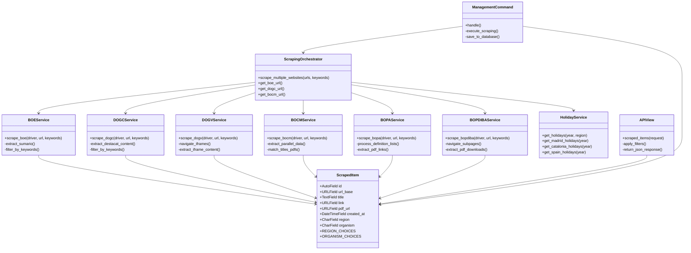
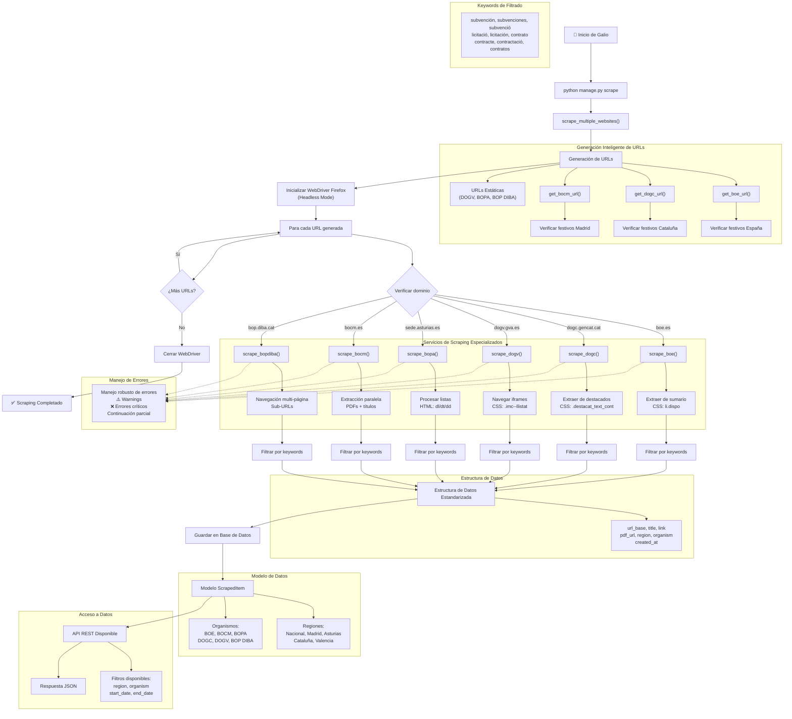

# Galio - Spanish Government Bulletin Web Scraper

Sistema automatizado de scraping para extraer información de subvenciones, licitaciones y contratos de boletines oficiales españoles nacionales y regionales.

## Descripción del Proyecto

Galio es un proyecto Django que implementa un sistema de web scraping que monitorea múltiples boletines oficiales españoles para extraer automáticamente información relevante sobre subvenciones, licitaciones y contratos públicos. El sistema soporta tanto el BOE nacional como boletines regionales de Cataluña, Valencia, Madrid, Asturias y Barcelona.

## Diagrama UML de Arquitectura



## Diagrama de Flujo del Sistema



## Arquitectura del Sistema

### Componentes Principales

- **Orquestador Central**: [1](#5-0) 
- **Servicios de Scraping Regionales**: Módulos especializados para cada boletín
- **Modelo de Datos**: [2](#5-1) 
- **API REST**: [3](#5-2) 
- **Comando de Gestión**: [4](#5-3) 

### Servicios de Scraping Soportados

| Boletín | Región | Características |
|---------|--------|-----------------|
| BOE | Nacional | Extracción de sumarios |
| DOGC | Cataluña | Parsing DOM directo |
| DOGV | Valencia | Manejo de iframes |
| BOCM | Madrid | Extracción paralela |
| BOPA | Asturias | Procesamiento de listas |
| BOP DIBA | Barcelona | Navegación multi-página |

## Instalación y Configuración

### Instalación con Docker

```bash
# Construir la imagen
docker build -t galio .

# Ejecutar el contenedor
docker run -d -p 8000:8000 galio
```

### Instalación Manual

```bash
# Instalar dependencias
pip install -r requirements.txt

# Configurar base de datos
python manage.py migrate

# Ejecutar scraping
python manage.py scrape
```

## Uso del Sistema

### Comando de Scraping

```bash
# Ejecutar scraping manual
python manage.py scrape
```

### API REST

```bash
# Obtener todos los elementos
GET /api/scraped-items/

# Filtrar por región
GET /api/scraped-items/?region=Cataluña

# Filtrar por organismo
GET /api/scraped-items/?organism=BOE

# Filtrar por fechas
GET /api/scraped-items/?start_date=2025-01-01&end_date=2025-12-31
```

### Palabras Clave de Filtrado

El sistema busca automáticamente contenido relacionado con: [5](#5-4) 

## Estructura del Proyecto

```
galio/
├── webscraper_project/
│   ├── scraper/
│   │   ├── models.py              # Modelo de datos
│   │   ├── views.py               # API REST
│   │   ├── services/
│   │   │   ├── scrape.py          # Orquestador principal
│   │   │   ├── boe_service.py     # Scraper BOE
│   │   │   ├── dogc_service.py    # Scraper DOGC
│   │   │   ├── dogv_service.py    # Scraper DOGV
│   │   │   ├── bocm_service.py    # Scraper BOCM
│   │   │   ├── bopa_service.py    # Scraper BOPA
│   │   │   ├── bopdiba_service.py # Scraper BOP DIBA
│   │   │   └── holidays.py        # Gestión de festivos
│   │   └── management/commands/
│   │       └── scrape.py          # Comando Django
│   ├── Dockerfile                 # Configuración Docker
│   └── requirements.txt           # Dependencias Python
```

## Notes

Wiki pages you might want to explore:
- [System Architecture (rcellas/galio)](/wiki/rcellas/galio#2)
- [Regional Scrapers (rcellas/galio)](/wiki/rcellas/galio#3.2)
- [Docker Configuration (rcellas/galio)](/wiki/rcellas/galio#4.2)
