# Galio - Spanish Government Bulletin Web Scraper

Sistema automatizado de scraping para extraer información de subvenciones, licitaciones y contratos de boletines oficiales españoles nacionales y regionales.

## Descripción del Proyecto

Galio es un proyecto Django que implementa un sistema de web scraping que monitorea múltiples boletines oficiales españoles para extraer automáticamente información relevante sobre subvenciones, licitaciones y contratos públicos. El sistema soporta tanto el BOE nacional como boletines regionales de Cataluña, Valencia, Madrid, Asturias y Barcelona.

## Diagrama UML de Arquitectura


## Diagrama de Flujo del Sistema

```mermaid
flowchart TD
    START["🚀 Inicio de Galio"] --> COMMAND["python manage.py scrape"]
    
    COMMAND --> ORCHESTRATOR["scrape_multiple_websites()"]
    
    ORCHESTRATOR --> URL_GEN["Generación de URLs"]
    
    subgraph "Generación Inteligente de URLs"
        URL_GEN --> BOE_URL["get_boe_url()"]
        URL_GEN --> DOGC_URL["get_dogc_url()"]
        URL_GEN --> BOCM_URL["get_bocm_url()"]
        URL_GEN --> STATIC_URLS["URLs Estáticas<br/>(DOGV, BOPA, BOP DIBA)"]
        
        BOE_URL --> HOLIDAYS1["Verificar festivos España"]
        DOGC_URL --> HOLIDAYS2["Verificar festivos Cataluña"]
        BOCM_URL --> HOLIDAYS3["Verificar festivos Madrid"]
    end
    
    URL_GEN --> DRIVER_INIT["Inicializar WebDriver Firefox<br/>(Headless Mode)"]
    
    DRIVER_INIT --> URL_LOOP["Para cada URL generada"]
    
    URL_LOOP --> DOMAIN_CHECK{"Verificar dominio"}
    
    DOMAIN_CHECK -->|"boe.es"| BOE_SERVICE["scrape_boe()"]
    DOMAIN_CHECK -->|"dogc.gencat.cat"| DOGC_SERVICE["scrape_dogc()"]
    DOMAIN_CHECK -->|"dogv.gva.es"| DOGV_SERVICE["scrape_dogv()"]
    DOMAIN_CHECK -->|"sede.asturias.es"| BOPA_SERVICE["scrape_bopa()"]
    DOMAIN_CHECK -->|"bocm.es"| BOCM_SERVICE["scrape_bocm()"]
    DOMAIN_CHECK -->|"bop.diba.cat"| BOPDIBA_SERVICE["scrape_bopdiba()"]
    
    subgraph "Servicios de Scraping Especializados"
        BOE_SERVICE --> BOE_EXTRACT["Extraer de sumario<br/>CSS: li.dispo"]
        DOGC_SERVICE --> DOGC_EXTRACT["Extraer de destacados<br/>CSS: .destacat_text_cont"]
        DOGV_SERVICE --> DOGV_EXTRACT["Navegar iframes<br/>CSS: .imc--llistat"]
        BOPA_SERVICE --> BOPA_EXTRACT["Procesar listas<br/>HTML: dl/dt/dd"]
        BOCM_SERVICE --> BOCM_EXTRACT["Extracción paralela<br/>PDFs + títulos"]
        BOPDIBA_SERVICE --> BOPDIBA_EXTRACT["Navegación multi-página<br/>Sub-URLs"]
    end
    
    BOE_EXTRACT --> KEYWORD_FILTER1["Filtrar por keywords"]
    DOGC_EXTRACT --> KEYWORD_FILTER2["Filtrar por keywords"]
    DOGV_EXTRACT --> KEYWORD_FILTER3["Filtrar por keywords"]
    BOPA_EXTRACT --> KEYWORD_FILTER4["Filtrar por keywords"]
    BOCM_EXTRACT --> KEYWORD_FILTER5["Filtrar por keywords"]
    BOPDIBA_EXTRACT --> KEYWORD_FILTER6["Filtrar por keywords"]
    
    subgraph "Keywords de Filtrado"
        KEYWORDS["subvención, subvenciones, subvenció<br/>licitació, licitación, contrato<br/>contracte, contractació, contratos"]
    end
    
    KEYWORD_FILTER1 --> DATA_STRUCTURE["Estructura de Datos Estandarizada"]
    KEYWORD_FILTER2 --> DATA_STRUCTURE
    KEYWORD_FILTER3 --> DATA_STRUCTURE
    KEYWORD_FILTER4 --> DATA_STRUCTURE
    KEYWORD_FILTER5 --> DATA_STRUCTURE
    KEYWORD_FILTER6 --> DATA_STRUCTURE
    
    subgraph "Estructura de Datos"
        DATA_STRUCTURE --> FIELDS["url_base, title, link<br/>pdf_url, region, organism<br/>created_at"]
    end
    
    DATA_STRUCTURE --> SAVE_DB["Guardar en Base de Datos"]
    
    SAVE_DB --> SCRAPED_ITEM["Modelo ScrapedItem"]
    
    subgraph "Modelo de Datos"
        SCRAPED_ITEM --> REGIONS["Regiones:<br/>Nacional, Madrid, Asturias<br/>Cataluña, Valencia"]
        SCRAPED_ITEM --> ORGANISMS["Organismos:<br/>BOE, BOCM, BOPA<br/>DOGC, DOGV, BOP DIBA"]
    end
    
    SCRAPED_ITEM --> API_ACCESS["API REST Disponible"]
    
    subgraph "Acceso a Datos"
        API_ACCESS --> FILTERS["Filtros disponibles:<br/>region, organism<br/>start_date, end_date"]
        API_ACCESS --> JSON_RESPONSE["Respuesta JSON"]
    end
    
    URL_LOOP --> MORE_URLS{"¿Más URLs?"}
    MORE_URLS -->|"Sí"| URL_LOOP
    MORE_URLS -->|"No"| CLEANUP["Cerrar WebDriver"]
    
    CLEANUP --> SUCCESS["✅ Scraping Completado"]
    
    subgraph "Manejo de Errores"
        ERROR_HANDLING["Manejo robusto de errores<br/>⚠️ Warnings<br/>❌ Errores críticos<br/>Continuación parcial"]
    end
    
    BOE_SERVICE -.-> ERROR_HANDLING
    DOGC_SERVICE -.-> ERROR_HANDLING
    DOGV_SERVICE -.-> ERROR_HANDLING
    BOPA_SERVICE -.-> ERROR_HANDLING
    BOCM_SERVICE -.-> ERROR_HANDLING
    BOPDIBA_SERVICE -.-> ERROR_HANDLING
```



## Arquitectura del Sistema

### Componentes Principales

- **Orquestador Central**: [1](#5-0) 
- **Servicios de Scraping Regionales**: Módulos especializados para cada boletín
- **Modelo de Datos**: [2](#5-1) 
- **API REST**: [3](#5-2) 
- **Comando de Gestión**: [4](#5-3) 

### Servicios de Scraping Soportados

| Boletín | Región | Características |
|---------|--------|-----------------|
| BOE | Nacional | Extracción de sumarios |
| DOGC | Cataluña | Parsing DOM directo |
| DOGV | Valencia | Manejo de iframes |
| BOCM | Madrid | Extracción paralela |
| BOPA | Asturias | Procesamiento de listas |
| BOP DIBA | Barcelona | Navegación multi-página |

## Instalación y Configuración

### Instalación con Docker

```bash
# Construir la imagen
docker build -t galio .

# Ejecutar el contenedor
docker run -d -p 8000:8000 galio
```

### Instalación Manual

```bash
# Instalar dependencias
pip install -r requirements.txt

# Configurar base de datos
python manage.py migrate

# Ejecutar scraping
python manage.py scrape
```

## Uso del Sistema

### Comando de Scraping

```bash
# Ejecutar scraping manual
python manage.py scrape
```

### API REST

```bash
# Obtener todos los elementos
GET /api/scraped-items/

# Filtrar por región
GET /api/scraped-items/?region=Cataluña

# Filtrar por organismo
GET /api/scraped-items/?organism=BOE

# Filtrar por fechas
GET /api/scraped-items/?start_date=2025-01-01&end_date=2025-12-31
```

### Palabras Clave de Filtrado

El sistema busca automáticamente contenido relacionado con: [5](#5-4) 

## Estructura del Proyecto

```
galio/
├── webscraper_project/
│   ├── scraper/
│   │   ├── models.py              # Modelo de datos
│   │   ├── views.py               # API REST
│   │   ├── services/
│   │   │   ├── scrape.py          # Orquestador principal
│   │   │   ├── boe_service.py     # Scraper BOE
│   │   │   ├── dogc_service.py    # Scraper DOGC
│   │   │   ├── dogv_service.py    # Scraper DOGV
│   │   │   ├── bocm_service.py    # Scraper BOCM
│   │   │   ├── bopa_service.py    # Scraper BOPA
│   │   │   ├── bopdiba_service.py # Scraper BOP DIBA
│   │   │   └── holidays.py        # Gestión de festivos
│   │   └── management/commands/
│   │       └── scrape.py          # Comando Django
│   ├── Dockerfile                 # Configuración Docker
│   └── requirements.txt           # Dependencias Python
```

## Notes

Wiki pages you might want to explore:
- [System Architecture (rcellas/galio)](/wiki/rcellas/galio#2)
- [Regional Scrapers (rcellas/galio)](/wiki/rcellas/galio#3.2)
- [Docker Configuration (rcellas/galio)](/wiki/rcellas/galio#4.2)
